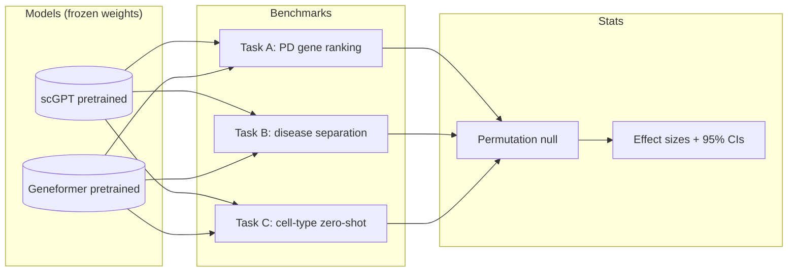

# scgpt-neurodegen-probe

*A zero-shot probe of single-cell foundation models on neurodegeneration tasks where the ground truth is biologically known — built to be defensible even when the answer is negative.*

[](https://github.com/abayatibrain/scgpt-neurodegen-probe/actions/workflows/ci.yml)  

## What biological question this answers

Pretrained single-cell foundation models like scGPT and Geneformer were
trained on tens of millions of cells, with sparse representation of
neurodegeneration. Do their zero-shot embeddings actually encode
neurodegeneration-relevant biology — for example, can they rank
PD-associated genes above random gene sets in substantia nigra
dopaminergic neuron contexts — and where do they fail?

Plain language: large pretrained models are now common in single-cell
biology, but their evaluation on disease tasks is uneven. This probe
runs three benchmarks where the answer is biologically known and
reports the result honestly — including the negative cases.

## Architecture



## Quickstart

```bash
git clone https://github.com/abayatibrain/scgpt-neurodegen-probe
cd scgpt-neurodegen-probe
uv sync
./scripts/download_data.sh
uv run scgpt-neurodegen-probe demo
```

## Method

Three benchmarks where ground truth is biologically defensible:

**Task A — PD gene ranking.** From the model's embedding of dopaminergic
neurons in a held-out atlas, rank all human genes by similarity to a
"PD signature" derived from OpenTargets-curated PD-associated genes.
Compare the rank distribution of held-out PD genes vs random
similarly-sized gene sets. Effect size: AUC of the empirical CDF
difference, with bootstrap CI.

**Task B — disease separation.** Embed dopaminergic neurons labeled with
PD vs AD vs ALS vs HD context. Measure embedding separability with
silhouette score and a permutation null. The honest hypothesis is that
diseases with shared mechanism (PD/AD via lysosomal dysfunction) overlap;
diseases with distinct mechanism (HD) separate.

**Task C — zero-shot cell-type classification.** On a held-out atlas
that was NOT in the model's training set, classify nuclei by cell type
using only the pretrained embedding and a few labeled exemplars. Report
macro-F1 with CI.

All three report effect sizes and 95% CIs; p-values only as a secondary
summary and never reported as `< 0.001` (exact below that).

## Limitations and honest caveats

- Foundation models on single-cell data are a contested area. Recent
  critiques (search "scGPT critique" / "single-cell foundation model
  evaluation") suggest naïve evaluations overstate performance. This
  repo cites those critiques in the Method section.
- Training-data contamination is a real risk: if the held-out atlas was
  in the model's pretraining corpus, the benchmark is meaningless. The
  data manifest documents the held-out atlas's provenance and pretraining
  corpus check.
- A positive result on any one benchmark does not mean the model
  "understands biology" — it means the model encodes correlations
  consistent with that benchmark.
- A negative result on all benchmarks does not mean the models are useless
  — it means *these specific benchmarks* do not light up. The README will
  say so plainly.

## What's next
- v0.2.0: Task A complete with first results table.
- v0.3.0: Task B + permutation null infrastructure.
- v1.0.0: all three benchmarks, results table with effect sizes + CIs,
  and the "what this does not show" section.

## Citation
See `CITATION.cff`.

## License
MIT.

---
Built by Armin Bayati ([arminbayati.org](https://arminbayati.org)).
