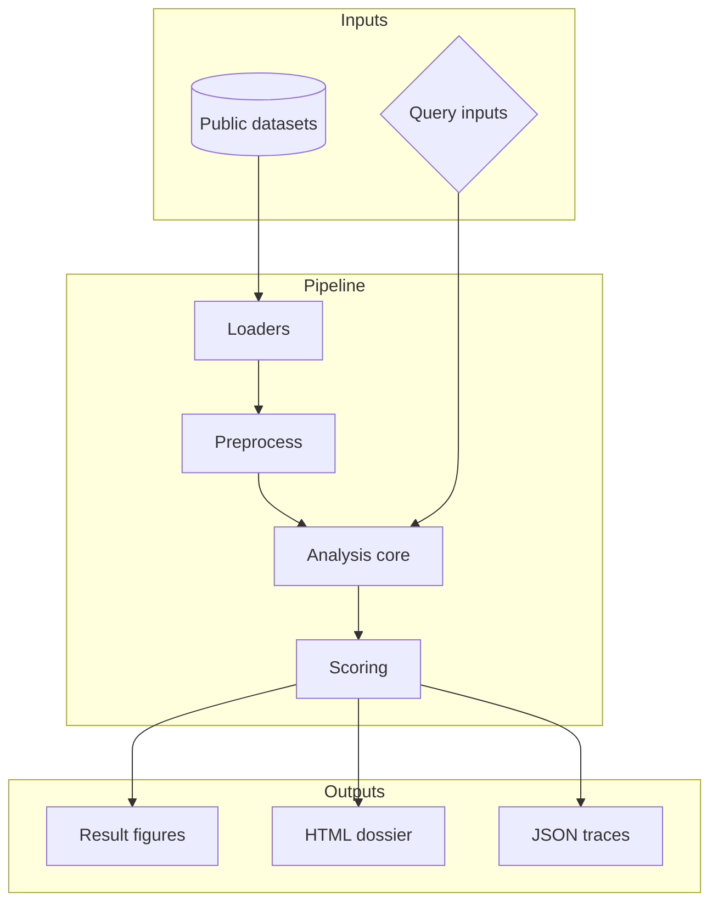

# Architecture

```mermaid
flowchart TB
    subgraph Inputs
        D[(Public datasets)]
        Q{Query inputs}
    end

    subgraph Pipeline
        L[Loaders] --> P[Preprocess]
        P --> A[Analysis core]
        A --> S[Scoring]
    end

    subgraph Outputs
        R[Result figures]
        H[HTML dossier]
        T[JSON traces]
    end

    D --> L
    Q --> A
    S --> R
    S --> H
    S --> T
```

This diagram is the "scan test" target from §2.3. A reader spending eight
seconds should be able to describe what this repo does from this diagram
alone.
